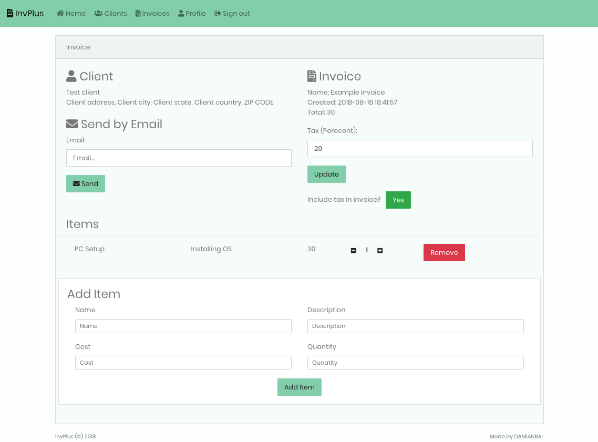

# InvPlus
> Platform for creating invoices made in Laravel

* Create clients
* Create invoices for clients
* Send invoices by email
* Download invoices as pdf



## Installation

```sh
composer install
```

setup your DB connection and mail settings and then run

```sh
php artisan migrate --seed
php artisan storage:link
```

Serve, create account and simply create invoices :)

## Meta

Damian Balandowski – balandowski@icloud.com